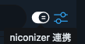

# niconizer-tweetdeck

[niconizer] client for Twitter.

## Installation

Google Chrome

1. Install [Tampermonkey]
2. Install [niconizer-tweetdeck]

## How to use

1. Launch [niconizer] and open tray icon menu then click `Start`
2. Login on [TweetDeck]
3. Open some timelines or searches you want watch
4. Enable watching for new tweet by clicking toggle switch that appears on top of each timeline  
   

[niconizer]: https://github.com/matzkoh/niconizer
[Tampermonkey]: https://chrome.google.com/webstore/detail/tampermonkey/dhdgffkkebhmkfjojejmpbldmpobfkfo
[niconizer-tweetdeck]: https://github.com/matzkoh/userscripts/raw/master/packages/niconizer-tweetdeck/dist/index.user.js
[TweetDeck]: https://tweetdeck.twitter.com/
