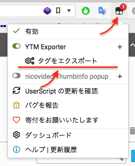

# YTM Exporter

Yahoo! タグマネージャーからデータをエクスポートするための[ユーザースクリプト]です

更新や移管の際に発生するタグの突き合わせ作業や、エクセルにエビデンスを作成する際の入力先ベースとして役立ちます

[ユーザースクリプト]: https://www.google.co.jp/search?q=%E3%83%A6%E3%83%BC%E3%82%B6%E3%83%BC%E3%82%B9%E3%82%AF%E3%83%AA%E3%83%97%E3%83%88

## 機能

- サービスタグ一覧をエクスポート
- スクリプト一覧をエクスポート

## インストール

1. Chrome に [Tampermonkey] をインストール
2. [YTM Exporter] をクリックしてインストール

[Tampermonkey]: https://chrome.google.com/webstore/detail/tampermonkey/dhdgffkkebhmkfjojejmpbldmpobfkfo
[YTM Exporter]: https://github.com/matzkoh/userscripts/raw/master/packages/ytm-exporter/dist/index.user.js

## 使用方法

### サービスタグ設定をエクセル CSV 形式でダウンロード

1. YTM 管理画面でサービスタグのリストが表示されているページを開く
   - アウトプット → `サービスタグ管理`
   - インプット → `ウェブサイト` → ページ → `サービスタグ設定`
2. エクスポートするタグにチェックをつけて選択する
3. 拡張のアイコンをクリックする
4. YTM Exporter の下にある `タグをエクスポート` をクリックする
5. 進捗バーが 100% になると CSV ファイルに保存されます

#### CSV の内容

| 列名           | 例                                                       | 説明                                                         |
| -------------- | -------------------------------------------------------- | ------------------------------------------------------------ |
| ID             | 7029086                                                  | タグ毎に一意な数値                                           |
| ステータス     | 有効                                                     |                                                              |
| タグ名         | 媒体 CV タグ                                             |                                                              |
| サービス提供元 | Yahoo! JAPAN                                             |                                                              |
| 作成日         | 2019年1月25日(金) 15:38                                  |                                                              |
| 更新日         | 2019年3月6日(水) 11:30                                   |                                                              |
| カスタムタグ   | ``                                 | スマートカスタムタグの設定内容 (カタログタグの場合は空欄) |
| カタログタグ   | `{"label":"***","amount":"0","spaceId":"***"}`           | カタログタグの設定内容 (スマートカスタムタグの場合は空欄) |
| タグ実行条件   | `([[タイトル]] == "Title" \|\| [[ボタンID]] == "btn-1")` | タグ実行条件 (AND は `&&`、OR は `\|\|` で表記)              |
| 実行ページ     | `https://example.com/**`                                 | 改行区切りの実行ページ URL                                   |

### ページ一覧をエクセル CSV 形式でダウンロード

1. YTM 管理画面でいずれかのページを開く
2. 拡張のアイコンをクリックする
3. YTM Exporter の下にある `ページをエクスポート` をクリックする
4. 進捗バーが 100% になると CSV ファイルに保存されます

#### CSV の内容

| 列名                      | 例                                                                 | 説明                                                      |
| ------------------------- | ------------------------------------------------------------------ | --------------------------------------------------------- |
| ID                        | 3822379                                                            | スクリプト毎に一意な数値                                  |
| 名前                      | 申込完了ページ                                                     |                                                           |
| 対象 URL パターン         | http://example.com/\*/cv.html http://example.com/\*/thanks.html | 改行区切り                                                |
| 対象外 URL パターン       | \*/test/\*                                                         |                                                           |
| URL の大文字/小文字を区別 | FALSE                                                              |                                                           |
| 削除済                    | FALSE                                                              | 削除されたページも内部的には残っていて、その場合は `TRUE` |
| 作成日                    | 2019年1月25日(金) 15:38                                            |                                                           |
| 更新日                    | 2019年3月6日(水) 11:30                                             |                                                           |

### スクリプト一覧をエクセル CSV 形式でダウンロード

1. YTM 管理画面でいずれかのページを開く
2. 拡張のアイコンをクリックする
3. YTM Exporter の下にある `スクリプトをエクスポート` をクリックする
4. 進捗バーが 100% になると CSV ファイルに保存されます

#### CSV の内容

| 列名          | 例                                          | 説明                                                         |
| ------------- | ------------------------------------------- | ------------------------------------------------------------ |
| ID            | 55b74a5c541e17839ad9237f                    | スクリプト毎に一意な文字列                                   |
| 実行順序      | 2                                           | 小さい方が先に実行される                                     |
| 名前          | jQuery                                      |                                                              |
| 説明          | jQuery を読み込む                           |                                                              |
| URL           | https://code.jquery.com/jquery-3.4.1.min.js | 外部スクリプトの URL (内部スクリプトの場合は空欄)         |
| コード        | `(function() { console.log(42); })();`      | JavaScript のコード (外部スクリプトの場合は空欄)          |
| 依存タグ ID   | 1234567 2234567                          | このスクリプトが実行されるタグの一覧 (改行区切りの ID)    |
| 依存タグ名    | Cv タグ Pv タグ                          | このスクリプトが実行されるタグの一覧 (改行区切りの名前)   |
| 依存ページ ID | 3234567 4234567                          | このスクリプトが実行されるページの一覧 (改行区切りの ID)  |
| 依存ページ名  | ランディングページ 申込完了ページ        | このスクリプトが実行されるページの一覧 (改行区切りの名前) |
